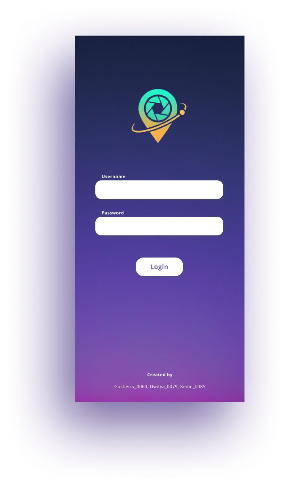
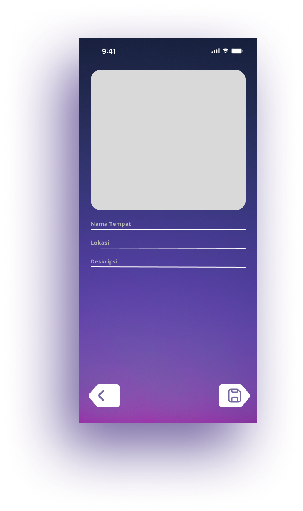
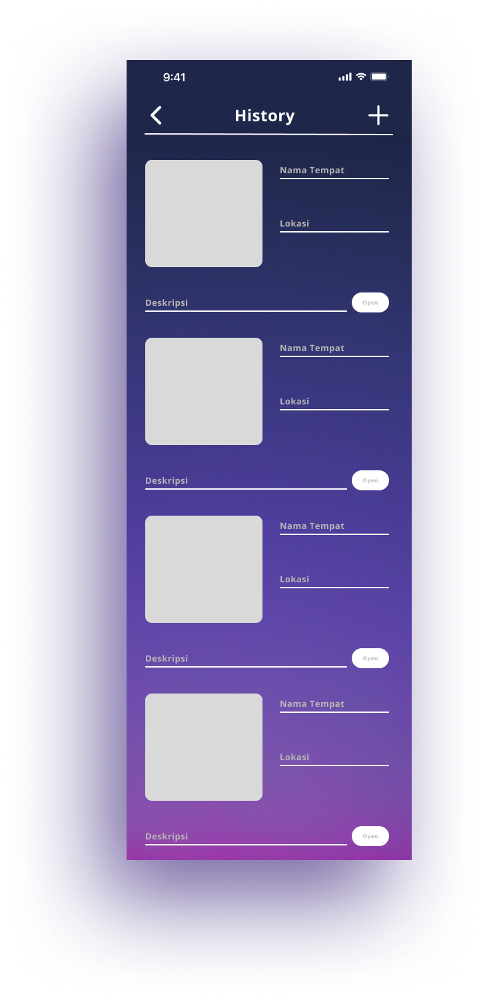
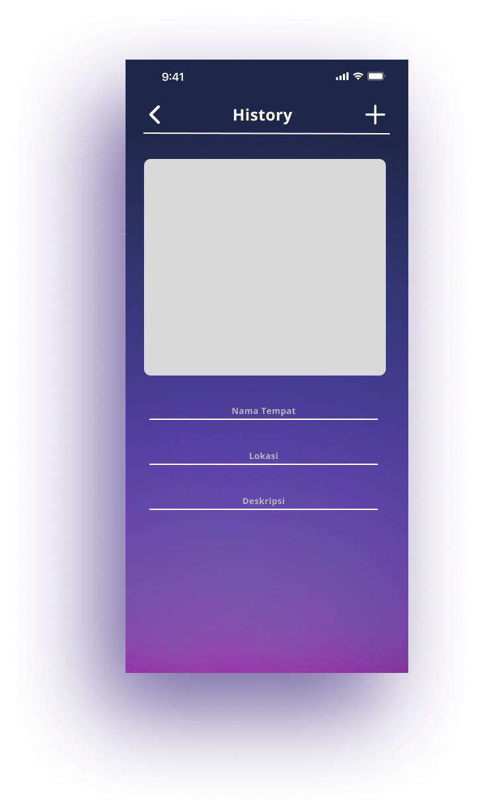
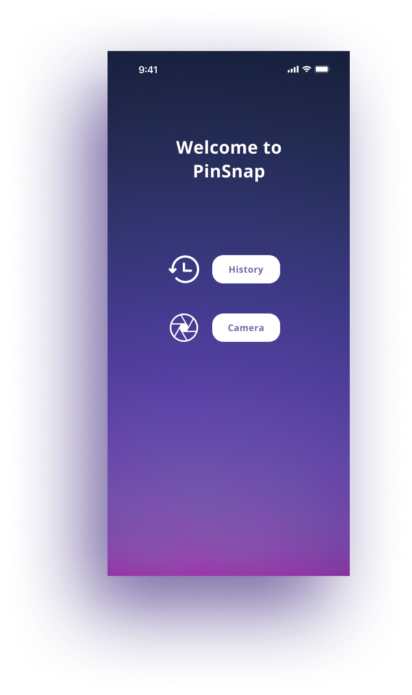
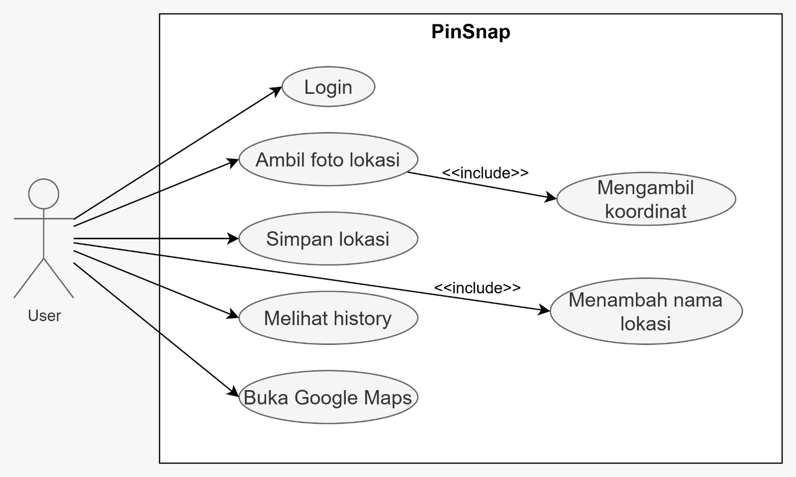

# PinSnap

PinSnap adalah aplikasi Android berbasis kamera dan geolokasi yang memungkinkan pengguna
menyimpan lokasi-lokasi menarik yang mereka temui secara langsung.  
Aplikasi ini menggabungkan pengambilan foto dengan pencatatan koordinat GPS secara otomatis,
sehingga setiap lokasi yang disimpan memiliki data yang akurat dan autentik

---

## Fitur Utama
- Ambil foto langsung dari aplikasi
- Pin lokasi otomatis menggunakan GPS
- Tambah nama atau keterangan tempat
- Simpan lokasi ke menu Saved
- Buka lokasi langsung di Google Maps

---

## Cara Kerja Aplikasi
1. Pengguna mengambil foto menggunakan kamera di dalam aplikasi  
2. Sistem otomatis mengambil koordinat GPS sesuai lokasi pengguna  
3. Pengguna menambahkan nama atau keterangan lokasi  
4. Data lokasi disimpan ke menu **Saved Location**  
5. Lokasi dapat dibuka kembali melalui Google Maps  

**Catatan:** Lokasi hanya dapat disimpan jika pengguna berada langsung di tempat tersebut.

---

## Desain Aplikasi (Figma)

### Login

### Kamera

### Tambah Lokasi

### Riwayat Lokasi

### Tampilan Umum

---

## Diagram UML
Diagram UML digunakan untuk menggambarkan struktur dan alur sistem aplikasi:

### Use Case Diagram

---

## Author
- I Kadek Dwitya Arinata        (2301010079)
- Kadek Diana Angelika P.       (2301010085)
- Ida Bagus Herry Putra Wibawa  (2301010063)
